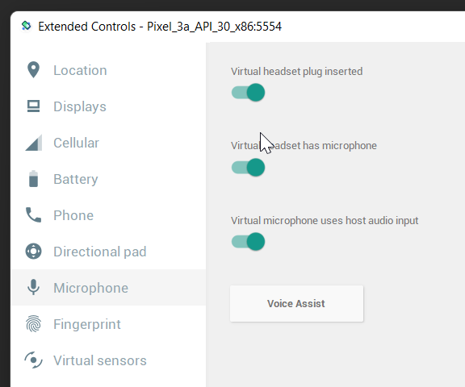

repo connected with this issue: https://stackoverflow.com/questions/73493620/react-native-voice-voice-not-working-with-latest-expo

be sure to enable microphone in emulator options

# conclusion
So the funny thing is that it worked from the beginning. Just not in an emulator... when I tested this on a real device it worked flawlessly, so I'll just leave it here as a 
resource... maybe someone will find it somehow and use it :) 